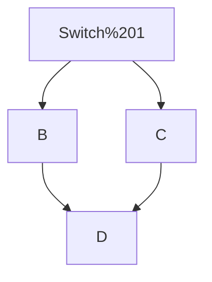

# Cisco IOS

Basic Network Cisco Switch IOS knowledge and configuration.


# Table of contents

- [Configuration](#Configuration)
	- [Default Switch Configuration](#default-switch-configuration)

- [Switch Management](#Switch-Management)
	- [Console Port Security - login](#console-port-security---login)
	- [Telnet access with an account](#telnet-access-with-an-account)

[test test](<#test test>)

---

# Configuration

## Default Switch Configuration

Switch
- WS-C3560-24PS

Cisco IOS
- 12.2(37)SE1

### a) Running configuration

By default we can see there is **no authentification** and **no config on interfaces**.

Following command shows the content of the configuration of a Cisco switch using IOS.

```
show running-config
```

```
Switch#show running-config 
Building configuration...

Current configuration : 1136 bytes
!
version 12.2(37)SE1
no service timestamps log datetime msec
no service timestamps debug datetime msec
no service password-encryption
!
hostname Switch
!
!
!
!
!
!
!
!
!
!
!
!
!
!
!
!
!
!
!
!
spanning-tree mode pvst
!
!
!
!
!
!
interface FastEthernet0/1
!
interface FastEthernet0/2
!
interface FastEthernet0/3
!
interface FastEthernet0/4
!
interface FastEthernet0/5
!
interface FastEthernet0/6
!
interface FastEthernet0/7
!
interface FastEthernet0/8
!
interface FastEthernet0/9
!
interface FastEthernet0/10
!
interface FastEthernet0/11
!
interface FastEthernet0/12
!
interface FastEthernet0/13
!
interface FastEthernet0/14
!
interface FastEthernet0/15
!
interface FastEthernet0/16
!
interface FastEthernet0/17
!
interface FastEthernet0/18
!
interface FastEthernet0/19
!
interface FastEthernet0/20
!
interface FastEthernet0/21
!
interface FastEthernet0/22
!
interface FastEthernet0/23
!
interface FastEthernet0/24
!
interface GigabitEthernet0/1
!
interface GigabitEthernet0/2
!
interface Vlan1
 no ip address
 shutdown
!
ip classless
!
ip flow-export version 9
!
!
!
!
!
!
!
!
line con 0
!
line aux 0
!
line vty 0 4
 login
!
!
!
!
end


Switch#
```

### b) Interfaces

As long as the interfaces of the switch are not connected to another devices they just stay in the status "notconnect".

```
show interfaces status
```

```
Switch#show interfaces status 
Port      Name               Status       Vlan       Duplex  Speed Type
Fa0/1                        notconnect   1          auto    auto  10/100BaseTX
Fa0/2                        notconnect   1          auto    auto  10/100BaseTX
Fa0/3                        notconnect   1          auto    auto  10/100BaseTX
Fa0/4                        notconnect   1          auto    auto  10/100BaseTX
Fa0/5                        notconnect   1          auto    auto  10/100BaseTX
Fa0/6                        notconnect   1          auto    auto  10/100BaseTX
Fa0/7                        notconnect   1          auto    auto  10/100BaseTX
Fa0/8                        notconnect   1          auto    auto  10/100BaseTX
Fa0/9                        notconnect   1          auto    auto  10/100BaseTX
Fa0/10                       notconnect   1          auto    auto  10/100BaseTX
Fa0/11                       notconnect   1          auto    auto  10/100BaseTX
Fa0/12                       notconnect   1          auto    auto  10/100BaseTX
Fa0/13                       notconnect   1          auto    auto  10/100BaseTX
Fa0/14                       notconnect   1          auto    auto  10/100BaseTX
Fa0/15                       notconnect   1          auto    auto  10/100BaseTX
Fa0/16                       notconnect   1          auto    auto  10/100BaseTX
Fa0/17                       notconnect   1          auto    auto  10/100BaseTX
Fa0/18                       notconnect   1          auto    auto  10/100BaseTX
Fa0/19                       notconnect   1          auto    auto  10/100BaseTX
Fa0/20                       notconnect   1          auto    auto  10/100BaseTX
Fa0/21                       notconnect   1          auto    auto  10/100BaseTX
Fa0/22                       notconnect   1          auto    auto  10/100BaseTX
Fa0/23                       notconnect   1          auto    auto  10/100BaseTX
Fa0/24                       notconnect   1          auto    auto  10/100BaseTX
Gig0/1                       notconnect   1          auto    auto  10/100BaseTX
Gig0/2                       notconnect   1          auto    auto  10/100BaseTX

Switch#
```

### c) VLANs

VLAN 1 is enabled by default and applied on every interfaces. It cannot be disabled.

```
show vlan
```

```
Switch#show vlan 

VLAN Name                             Status    Ports
---- -------------------------------- --------- -------------------------------
1    default                          active    Fa0/1, Fa0/2, Fa0/3, Fa0/4
                                                Fa0/5, Fa0/6, Fa0/7, Fa0/8
                                                Fa0/9, Fa0/10, Fa0/11, Fa0/12
                                                Fa0/13, Fa0/14, Fa0/15, Fa0/16
                                                Fa0/17, Fa0/18, Fa0/19, Fa0/20
                                                Fa0/21, Fa0/22, Fa0/23, Fa0/24
                                                Gig0/1, Gig0/2
1002 fddi-default                     active    
1003 token-ring-default               active    
1004 fddinet-default                  active    
1005 trnet-default                    active    

VLAN Type  SAID       MTU   Parent RingNo BridgeNo Stp  BrdgMode Trans1 Trans2
---- ----- ---------- ----- ------ ------ -------- ---- -------- ------ ------
1    enet  100001     1500  -      -      -        -    -        0      0
1002 fddi  101002     1500  -      -      -        -    -        0      0   
1003 tr    101003     1500  -      -      -        -    -        0      0   
1004 fdnet 101004     1500  -      -      -        ieee -        0      0   
1005 trnet 101005     1500  -      -      -        ibm  -        0      0   

VLAN Type  SAID       MTU   Parent RingNo BridgeNo Stp  BrdgMode Trans1 Trans2
---- ----- ---------- ----- ------ ------ -------- ---- -------- ------ ------

Remote SPAN VLANs
------------------------------------------------------------------------------

Primary Secondary Type              Ports
------- --------- ----------------- ------------------------------------------
Switch#
```


---

# Switch Management

## Console Port Security - login

```
line console 0
password mypassword
login
```

``` ruby
Switch#configure terminal 
Enter configuration commands, one per line.  End with CNTL/Z.
Switch(config)#line console 0
Switch(config-line)#password mypassword
Switch(config-line)#login
Switch(config-line)#^Z
Switch#
%SYS-5-CONFIG_I: Configured from console by console

Switch#show running-config ?
  |  Output Modifiers
  <cr>
Switch#show running-config 
Building configuration...

[...]
!
!
line con 0
 password mypassword
 login
!
line aux 0
!
line vty 0 4
 login
!
!
!
!
end


Switch#
```

> [!WARNING]
> 
> Console login is in cleartext in the configuration.


## Telnet access with an account

```
enable secret cisco
username myaccount secret mypassword
line vty 0 15
login local
transport input telnet
```

``` bash
Switch#configure terminal 
Enter configuration commands, one per line.  End with CNTL/Z.
Switch(config)#enable secret cisco
Switch(config)#username myaccount secret mypassword
Switch(config)#line vty 0 15
Switch(config-line)#login local
Switch(config-line)#transport input telnet
Switch(config-line)#^Z
Switch#
%SYS-5-CONFIG_I: Configured from console by console
Switch#show running-config 
Building configuration...

Current configuration : 1355 bytes
!
version 12.2(37)SE1
no service timestamps log datetime msec
no service timestamps debug datetime msec
no service password-encryption
!
hostname Switch
!
!
enable secret 5 $1$mERr$hx5rVt7rPNoS4wqbXKX7m0
!
!
!
!
!
!
!
!
username myaccount secret 5 $1$mERr$7sOd0mgRuXYhHwfWsV4QZ/
!
!
[...]
!
line vty 0 4
 login local
 transport input telnet
line vty 5 15
 login local
 transport input telnet
!
!
!
!
end


Switch#
```

> [!WARNING]
> 
> Passwords are encrypted but Telnet is a non-secure protocol. Do not use Telnet if security is needed.


# test test

> 1
> 2
> 3


> enable secret cisco
> username myaccount secret mypassword
> line vty 0 15
> login local
> transport input telnet


4
5
6  


```
line console 0
password mypassword
login
```


> Switch#configure terminal 
> Enter configuration commands, one per line.  End with CNTL/Z.
> Switch(config)#line console 0
> Switch(config-line)#password mypassword
> Switch(config-line)#login
> Switch(config-line)#^Z
> Switch#
> %SYS-5-CONFIG_I: Configured from console by console
> 
> Switch#show running-config ?
>   |  Output Modifiers
>   <cr\>
> Switch#show running-config 
> Building configuration...
> 
> [...]
> !
> !
> line con 0
>  password mypassword
>  login
> !
> line aux 0
> !
> line vty 0 4
>  login
> !
> !
> !
> !
> end
> 
> 
> Switch#


<div style="background-color: rgb(255, 50, 50);">

``
Switch#configure terminal  
Enter configuration commands, one per line. End with CNTL/Z.  
Switch(config)#line console 0  
Switch(config-line)#password mypassword  
Switch(config-line)#login  
Switch(config-line)#^Z  
Switch#  
%SYS-5-CONFIG_I: Configured from console by console

Switch#show running-config ?  
| Output Modifiers  
  
Switch#show running-config  
Building configuration...

[...]  
!  
!  
line con 0  
password mypassword  
login  
!  
line aux 0  
!  
line vty 0 4  
login  
!  
!  
!  
!  
end

Switch#
``

</div>

> [!NOTE]
> Switch#configure terminal  
> Enter configuration commands, one per line. End with CNTL/Z.  
> Switch(config)#line console 0  
> Switch(config-line)#password mypassword  
> Switch(config-line)#login  
> Switch(config-line)#^Z  
> Switch#  
> %SYS-5-CONFIG_I: Configured from console by console
> 
> Switch#show running-config ?  
> | Output Modifiers  
>   
> Switch#show running-config  
> Building configuration...
> 
> [...]  
> !  
> !  
> line con 0  
> password mypassword  
> login  
> !  
> line aux 0  
> !  
> line vty 0 4  
> login  
> !  
> !  
> !  
> !  
> end
> 
> Switch#





``` c
Switch#configure terminal 
Enter configuration commands, one per line.  End with CNTL/Z.
Switch(config)#enable secret cisco
Switch(config)#username myaccount secret mypassword
Switch(config)#line vty 0 15
Switch(config-line)#login local
Switch(config-line)#transport input telnet
Switch(config-line)#^Z
Switch#
%SYS-5-CONFIG_I: Configured from console by console
Switch#show running-config 
Building configuration...

Current configuration : 1355 bytes
!
version 12.2(37)SE1
no service timestamps log datetime msec
no service timestamps debug datetime msec
no service password-encryption
!
hostname Switch
!
!
enable secret 5 $1$mERr$hx5rVt7rPNoS4wqbXKX7m0
!
!
!
!
!
!
!
!
username myaccount secret 5 $1$mERr$7sOd0mgRuXYhHwfWsV4QZ/
!
!
[...]
!
line vty 0 4
 login local
 transport input telnet
line vty 5 15
 login local
 transport input telnet
!
!
!
!
end


Switch#
```


``` bash
Switch#configure terminal 
Enter configuration commands, one per line.  End with CNTL/Z.
Switch(config)#enable secret cisco
Switch(config)#username myaccount secret mypassword
Switch(config)#line vty 0 15
Switch(config-line)#login local
Switch(config-line)#transport input telnet
Switch(config-line)#^Z
Switch#
%SYS-5-CONFIG_I: Configured from console by console
Switch#show running-config 
Building configuration...

Current configuration : 1355 bytes
!
version 12.2(37)SE1
no service timestamps log datetime msec
no service timestamps debug datetime msec
no service password-encryption
!
hostname Switch
!
!
enable secret 5 $1$mERr$hx5rVt7rPNoS4wqbXKX7m0
!
!
!
!
!
!
!
!
username myaccount secret 5 $1$mERr$7sOd0mgRuXYhHwfWsV4QZ/
!
!
[...]
!
line vty 0 4
 login local
 transport input telnet
line vty 5 15
 login local
 transport input telnet
!
!
!
!
end


Switch#
```


``` python
Switch#configure terminal 
Enter configuration commands, one per line.  End with CNTL/Z.
Switch(config)#enable secret cisco
Switch(config)#username myaccount secret mypassword
Switch(config)#line vty 0 15
Switch(config-line)#login local
Switch(config-line)#transport input telnet
Switch(config-line)#^Z
Switch#
%SYS-5-CONFIG_I: Configured from console by console
Switch#show running-config 
Building configuration...

Current configuration : 1355 bytes
!
version 12.2(37)SE1
no service timestamps log datetime msec
no service timestamps debug datetime msec
no service password-encryption
!
hostname Switch
!
!
enable secret 5 $1$mERr$hx5rVt7rPNoS4wqbXKX7m0
!
!
!
!
!
!
!
!
username myaccount secret 5 $1$mERr$7sOd0mgRuXYhHwfWsV4QZ/
!
!
[...]
!
line vty 0 4
 login local
 transport input telnet
line vty 5 15
 login local
 transport input telnet
!
!
!
!
end


Switch#
```


```
show vlan
```

<details>
<summary>Output</summary>

```
Switch#show vlan 

VLAN Name                             Status    Ports
---- -------------------------------- --------- -------------------------------
1    default                          active    Fa0/1, Fa0/2, Fa0/3, Fa0/4
                                                Fa0/5, Fa0/6, Fa0/7, Fa0/8
                                                Fa0/9, Fa0/10, Fa0/11, Fa0/12
                                                Fa0/13, Fa0/14, Fa0/15, Fa0/16
                                                Fa0/17, Fa0/18, Fa0/19, Fa0/20
                                                Fa0/21, Fa0/22, Fa0/23, Fa0/24
                                                Gig0/1, Gig0/2
1002 fddi-default                     active    
1003 token-ring-default               active    
1004 fddinet-default                  active    
1005 trnet-default                    active    

VLAN Type  SAID       MTU   Parent RingNo BridgeNo Stp  BrdgMode Trans1 Trans2
---- ----- ---------- ----- ------ ------ -------- ---- -------- ------ ------
1    enet  100001     1500  -      -      -        -    -        0      0
1002 fddi  101002     1500  -      -      -        -    -        0      0   
1003 tr    101003     1500  -      -      -        -    -        0      0   
1004 fdnet 101004     1500  -      -      -        ieee -        0      0   
1005 trnet 101005     1500  -      -      -        ibm  -        0      0   

VLAN Type  SAID       MTU   Parent RingNo BridgeNo Stp  BrdgMode Trans1 Trans2
---- ----- ---------- ----- ------ ------ -------- ---- -------- ------ ------

Remote SPAN VLANs
------------------------------------------------------------------------------

Primary Secondary Type              Ports
------- --------- ----------------- ------------------------------------------
Switch#
```
</details>


```
Switch#show vlan 

VLAN Name                             Status    Ports
---- -------------------------------- --------- -------------------------------
1    default                          active    Fa0/1, Fa0/2, Fa0/3, Fa0/4
                                                Fa0/5, Fa0/6, Fa0/7, Fa0/8
                                                Fa0/9, Fa0/10, Fa0/11, Fa0/12
                                                Fa0/13, Fa0/14, Fa0/15, Fa0/16
                                                Fa0/17, Fa0/18, Fa0/19, Fa0/20
                                                Fa0/21, Fa0/22, Fa0/23, Fa0/24
                                                Gig0/1, Gig0/2
1002 fddi-default                     active    
1003 token-ring-default               active    
1004 fddinet-default                  active    
1005 trnet-default                    active    

VLAN Type  SAID       MTU   Parent RingNo BridgeNo Stp  BrdgMode Trans1 Trans2
---- ----- ---------- ----- ------ ------ -------- ---- -------- ------ ------
1    enet  100001     1500  -      -      -        -    -        0      0
1002 fddi  101002     1500  -      -      -        -    -        0      0   
1003 tr    101003     1500  -      -      -        -    -        0      0   
1004 fdnet 101004     1500  -      -      -        ieee -        0      0   
1005 trnet 101005     1500  -      -      -        ibm  -        0      0   

VLAN Type  SAID       MTU   Parent RingNo BridgeNo Stp  BrdgMode Trans1 Trans2
---- ----- ---------- ----- ------ ------ -------- ---- -------- ------ ------

Remote SPAN VLANs
------------------------------------------------------------------------------

Primary Secondary Type              Ports
------- --------- ----------------- ------------------------------------------
Switch#
```

